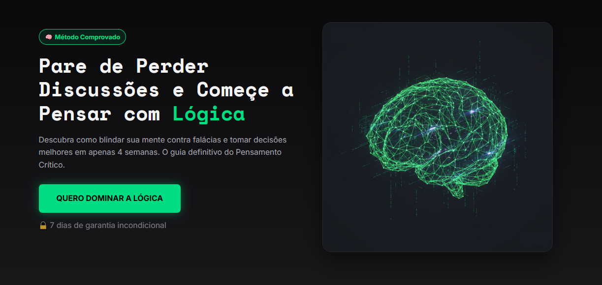

# Landing Page: Mestre da Lógica 🧠


> **Uma Landing Page de alta conversão focada em Copywriting e Design Persuasivo.**

<div align="center">
  
  <br><br>
  
  ### 🔗 [CLIQUE AQUI PARA VER O PROJETO ONLINE](https://jeiversonchristian.github.io/landing-page-mestre-da-logica/)
  
  <br>
</div>

## 📖 Sobre o Projeto
Este é um projeto de estudo e portfólio focado na criação de uma **Landing Page de Alta Conversão**. 

O objetivo foi simular um cenário real de venda de um produto digital (um curso online de Lógica e Pensamento Crítico), aplicando técnicas de **Copywriting** (AIDA/PAS), **Design Persuasivo** e **Otimização de Performance**.

Este projeto serve como modelo base (boilerplate) para serviços de criação de páginas de vendas (Sales Pages) para infoprodutores.

## ✨ Funcionalidades Implementadas
* ✅ **Hero Section Impactante:** Manchete, subtítulo e CTA otimizados para conversão.
* ✅ **Seção de "Dor e Solução":** Cards interativos apresentando problemas e o método como solução.
* ✅ **Prova Social:** Seção de depoimentos com fotos realistas para gerar autoridade.
* ✅ **Accordion (FAQ):** Perguntas frequentes com lógica exclusiva (abre um, fecha o outro).
* ✅ **Contador de Escassez:** Timer regressivo em JavaScript que reinicia diariamente (gatilho de urgência).
* ✅ **Scroll Suave:** Navegação fluida entre as seções da página.
* ✅ **Design Totalmente Responsivo:** Layout adaptável para Mobile, Tablet e Desktop.

## 🚀 Tecnologias Utilizadas
* **HTML5 Semântico:** Estrutura acessível e otimizada para SEO.
* **CSS3 Moderno:** * Variáveis (`:root`) para consistência de cores e fontes.
    * **Flexbox** e **CSS Grid** para layouts complexos.
    * Design responsivo com Media Queries.
* **JavaScript (ES6+):** * Manipulação do DOM.
    * Módulos (`import/export`) para código limpo e organizado.
* **Ativos:**
    * Ícones: [Phosphor Icons](https://phosphoricons.com/).
    * Fontes: Google Fonts.

## 📂 Estrutura do Projeto
O projeto segue uma arquitetura modular para facilitar a manutenção e escalabilidade:

```text
/
├── css/
│   ├── global.css        # Variáveis, resets e estilos gerais
│   └── modulos/          # Estilos separados por seção (hero, oferta, faq, etc.)
├── js/
│   ├── app.js            # Arquivo principal (Maestro)
│   └── modulos/          # Lógica separada (faq.js, timer.js)
├── imagens/              # Ativos visuais e prints
└── index.html            # Estrutura principal
```

## 👨‍💻 Autor
Desenvolvido com 🧠 por Jeiverson Christian.